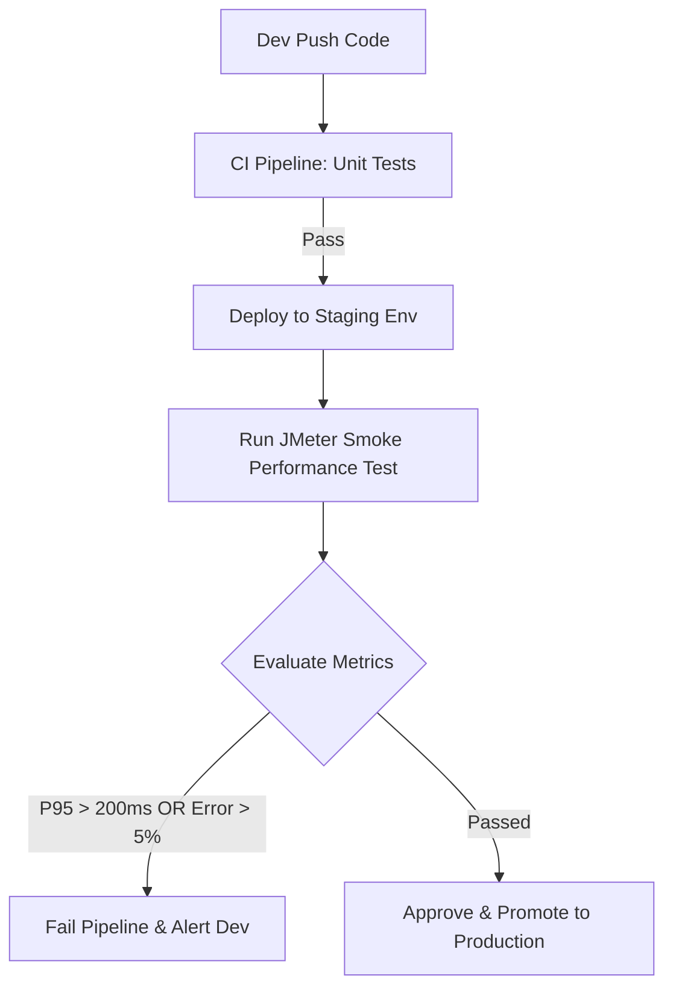

# BÁO CÁO BÀI TẬP 05 - KIỂM THỬ HIỆU NĂNG

**Môn học:** Kiểm chứng Phần mềm (CS423/CSC13003)
**Sinh viên:** NGUYỄN NHẬT NAM - 23127092 - 23KTPM2
**Github Repository:** [https://github.com/ngnam2012/23KTPM2_Testing_HW05](https://github.com/ngnam2012/23KTPM2_Testing_HW05)
**Demo Video:** [https://youtu.be/96VPOwmu7h0](https://youtu.be/96VPOwmu7h0)
**Agent Skill Demo Video:** [https://youtu.be/-cdfdlpFUzM](https://youtu.be/-cdfdlpFUzM)

---

## PHẦN 1: TỔNG QUAN & PHẠM VI KIỂM THỬ (SUT & SCOPE)

### 1.1 Thông tin Môi trường (Hardware Spec)

Tất cả các bài test được chạy độc lập trên máy local (Load Generator) hướng vào SUT đang chạy ở `localhost:3000`.

- **Hostname:** `NNAM`
- **Hệ điều hành:** Microsoft Windows 11 Pro (64-bit, Build 26200)
- **CPU:** 12th Gen Intel(R) Core(TM) i7-1260P (12 Cores / 16 Threads, up to 4.70 GHz)
- **RAM:** 32.0 GB LPDDR5 (31.71 GB usable)
- **Công cụ Test:** Apache JMeter 5.6.3
- **SUT Runtime:** Node.js v22.19.0 / Express 4.x / SQLite3

### 1.2 End-to-end Workflow (Scope)

Kịch bản test giả lập hành vi một khách hàng trải nghiệm quy trình mua sắm hoàn chỉnh, bao phủ cả 3 nhóm Endpoints yêu cầu:

1. **[Auth-heavy]** Đăng nhập vào hệ thống (`POST /api/login`) -> Token được lưu lại cho các request tiếp theo.
2. **[Read-heavy]** Lấy thông tin cá nhân (`GET /api/users/me`), xem danh sách sản phẩm (`GET /api/products`), chọn và xem chi tiết sản phẩm đầu tiên (`GET /api/products/{id}`).
3. **[Transactional]** Áp dụng mã giảm giá (`POST /api/apply-coupon`), tạo đơn hàng Checkout (`POST /api/checkout`), và cuối cùng là huỷ đơn hàng vừa đặt (`PUT /api/orders/{id}/cancel`).

**Data-Driven:** Toàn bộ user (22 accounts), danh sách products và coupons đều được ánh xạ từ các file CSV (`data/credentials.csv`, `products.csv`, `coupons.csv`). Do SQLite có hạn chế về write-lock, cấu hình Thread được set tối đa 22 Threads (tương ứng với 22 tài khoản) để tránh dùng chung account.

---

## PHẦN 2: TASK 1 - THIẾT KẾ KỊCH BẢN VÀ KẾT QUẢ THỰC NGHIỆM

### 2.1 Đánh giá thiết kế do AI sinh ra (AI Design Flaws - Human Review)

Khi sử dụng AI để tạo bản nháp JMX ban đầu, tôi đã phát hiện và phải chỉnh sửa các lỗi nghiêm trọng sau (được giải trình kỹ hơn trong bản AI Audit):

- **Bỏ qua Account Lockout:** AI bắn request dồn dập vào API Login dẫn đến lỗi timeout, DB cộng `login_attempts` vượt quá 3 lần khiến tài khoản bị khóa hàng loạt, các API đằng sau bị `403 Forbidden`. -> _Khắc phục: Thêm Script `reset_db.js` và chia Account qua CSV._
- **Thiếu Think-time:** Bản nháp AI không có thời gian nghỉ khiến Load Test vô tình trở thành Stress/Spike test. -> _Khắc phục: Thêm Uniform Random Timer (2000-3000ms delay) giữa các request._

### 2.2 Kết quả Kiểm thử Tổng hợp (Load vs Stress vs Spike)

_Kết quả được trích xuất trực tiếp từ các file `statistics.json` sau lần chạy mới nhất (2026-08-17):_

| Metric (Toàn hệ thống) | Load Test (22 Threads) | Stress Test (Tăng tốc) | Spike Test (Đỉnh điểm) |
| :--------------------- | :--------------------- | :--------------------- | :--------------------- |
| **Total Samples**      | 3,158 requests         | 13,631 requests        | 5,304 requests         |
| **Throughput (req/s)** | 10.54 req/s            | 45.52 req/s            | 89.35 req/s            |
| **Error Rate**         | 69.79%                 | 69.77%                 | 67.38%                 |
| **P95 Response Time**  | 4.0 ms                 | 4.0 ms                 | 5.0 ms                 |
| **Avg Response Time**  | 2.14 ms                | 2.26 ms                | 2.95 ms                |

**Ghi chú:** Do Node.js là non-blocking I/O và hệ thống bị lỗi chặn nghiệp vụ (Bug account lockout, DB khóa), request bị từ chối trả về 4xx/5xx ngay lập tức (Fast Failure). Điều này giải thích tại sao Response Time lại vô cùng thấp (chỉ vài ms) mặc dù Error Rate lại rất cao (~70%).

### 2.3 Đo lường Threshold (Endurance Test)

- **Cấu hình:** 22 Threads, duy trì liên tục trong **15 phút**.
- **Kết quả (Metrics):** Tổng số `9,719` requests. Tốc độ ổn định ở **10.80 req/s**. Response Time P95 duy trì ở **44.0 ms** (P90 là **9.0 ms**). Error Rate là **69.94%**.
- **Memory / Ngưỡng độ bền:** Không có hiện tượng rò rỉ bộ nhớ (Memory Leak). Ứng dụng Node.js đạt trần RAM (Memory ceiling) khoảng 67.6 MB và duy trì phẳng.
- **Kết luận:** Giới hạn của hệ thống không nằm ở dung lượng RAM hay CPU xử lý, mà hoàn toàn phụ thuộc vào kiến trúc (cơ chế Lock của SQLite khi ghi đồng thời) và các Bugs logic chưa được sửa.

---

## PHẦN 3: TASK 2 - AI ANALYSIS & MISINTERPRETATION HUNT

Trong quá trình để AI đọc file log `.jtl` và phân tích, tôi đã tiến hành "kiểm chứng chéo" lại báo cáo của AI.

### 3.1 Misinterpretation Hunt (Tìm lỗi chém gió của AI)

- **Lỗi suy diễn Điểm gãy (Breaking point):** AI nhận định rằng _"Hệ thống bị sập do RAM bị quá tải (In-memory cart tràn)"_.
  - **Sự thật (từ Log):** RAM Node.js hoàn toàn ổn định qua cả Endurance test. Nguyên nhân gốc của Error Rate cao là do `SQLITE_BUSY` (database is locked) và cơ chế khóa tài khoản người dùng sau 3 lần sai mật khẩu của hệ thống, chứ không phải Memory Crash.
- **Lỗi đánh giá hiệu năng sai lầm:** AI khen hệ thống _"Chịu tải rất tốt vì Response time luôn nằm dưới 6ms"_.
  - **Sự thật (từ Log):** Nhìn vào Error Rate > 71%, rõ ràng là SUT thực hiện "Fast Failure". App trả về lỗi ngay tức khắc thay vì phải tốn thời gian tính toán. Việc response time thấp lúc này là minh chứng của việc xử lý lỗi chứ không phải xử lý thành công.

### 3.2 Judge the AI's Recommendations (Đánh giá các giải pháp tối ưu)

AI đề xuất các giải pháp kiến trúc. Tôi phân loại chúng như sau:

1. **Triển khai Connection Pooling cho SQLite:** -> **Hallucinated (Sai kiến trúc).** SQLite là database dạng file, chỉ cho phép 1 luồng ghi duy nhất. Việc dùng Connection pool như ở MySQL hay Postgres là không khả thi và vô nghĩa với SQLite.
2. **Bật chế độ WAL (Write-Ahead Logging) cho SQLite:** -> **Feasible.** Thiết lập `PRAGMA journal_mode=WAL;` sẽ cho phép ứng dụng Node.js thực hiện nhiều luồng đọc đồng thời mà không bị block bởi luồng ghi. Rất khả thi.
3. **Chuyển hàm băm Bcrypt ra Worker Threads:** -> **Feasible.** Bcrypt ngốn CPU và làm nghẽn Event Loop duy nhất của Node.js, gây delay cho toàn bộ API khác. Chạy qua Worker là giải pháp cực tốt.

---

## PHẦN 4: TASK 3 - CONTINUOUS PERFORMANCE TESTING PROPOSAL

Nhằm đảm bảo hiệu năng SUT không bị suy thoái khi cập nhật tính năng mới (Performance Regression), tôi đề xuất tích hợp **Automated Performance Testing** vào CI/CD Pipeline (GitHub Actions).

### 4.1 Quy trình (Flow Chart)

### 4.2 Các đánh đổi (Trade-offs)

- **Về Chi phí (Cost):** Tốn tiền duy trì một server Staging cấu hình tương đồng Production (nếu server test yếu hơn, P95 đo ra sẽ không chính xác).
- **Về Thời gian (Pipeline Delay):** Các test như Endurance/Load mất ít nhất 15-30 phút, nếu chạy trên mọi commit sẽ làm chậm tốc độ Release.
  - _Giải pháp:_ CI ban ngày chỉ chạy Smoke Test ngắn (1 phút). Endurance/Load Test đầy đủ chuyển sang chạy tự động vào lúc nửa đêm (Nightly Build).
- **Về Cảnh báo giả (False Alarms):** Môi trường mạng nhiễu hoặc do các tác vụ quét virus ngầm trên Staging làm Response time thỉnh thoảng vọt lên quá ngưỡng (Spike lag). Do đó cần thiết lập cơ chế Retry từ 2-3 lần trước khi đánh rớt Pipeline.

---

## PHẦN 5: TÀI NGUYÊN NỘP BÀI & AGENT SKILLS

- **Mã nguồn Github:** [https://github.com/ngnam2012/23KTPM2_Testing_HW05](https://github.com/ngnam2012/23KTPM2_Testing_HW05)
- **Video Demo Performance Testing (Tối thiểu 6 phút):** [https://youtu.be/96VPOwmu7h0](https://youtu.be/96VPOwmu7h0)
- **Video Demo Agent Skill (Tự động kiểm thử & báo cáo):** [https://youtu.be/-cdfdlpFUzM](https://youtu.be/-cdfdlpFUzM)
- **Cấu hình Skill lưu tại:** `.agents/skills/auto-perf-tester/SKILL.md`

---
