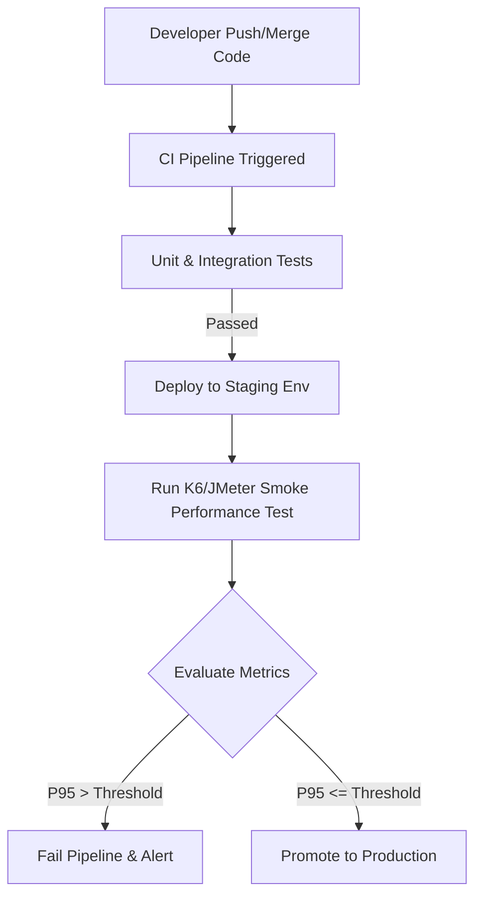

# Đề xuất Tích hợp Kiểm thử Hiệu năng Liên tục (Continuous Performance Testing)

## 1. Mô hình đề xuất

Để đảm bảo hệ thống EShop không bị suy thoái hiệu năng sau mỗi lần cập nhật mã nguồn (regression), tôi đề xuất tích hợp **Continuous Performance Testing** vào pipeline CI/CD (vd: GitHub Actions hoặc GitLab CI).

**Quy trình (Flow Chart):**

## 2. Các ngưỡng đánh giá (Thresholds)
- **Response Time (P95):** Phải nhỏ hơn 200ms cho các API Read-heavy (Search, Product Detail).
- **Error Rate:** Phải dưới 1% cho các kịch bản Load thông thường.
- **Throughput:** Không giảm quá 10% so với baseline của commit trước đó.

## 3. Đánh giá Trade-offs (Đánh đổi)

**Ưu điểm:**
- Phát hiện ngay lập tức các đoạn code làm chậm hệ thống (vd: vòng lặp vô hạn, thiếu index database, N+1 query).
- Ngăn chặn lỗi tốn tài nguyên lên môi trường Production.

**Nhược điểm (Trade-offs):**
- **Chi phí hạ tầng:** Chạy test hiệu năng yêu cầu môi trường Staging có cấu hình tương đương Production, gây tốn kém chi phí server.
- **Thời gian chờ CI (Pipeline Time):** Performance test thường chạy lâu (10-15 phút). Nếu chạy trên mọi commit sẽ làm giảm tốc độ release.
  - *Giải pháp:* Chỉ chạy Load Test ngắn (Smoke Test) trên mọi commit, và chạy Endurance/Stress test đầy đủ vào ban đêm (Nightly build).
- **False Alarms:** Môi trường test có thể bị nhiễu (noise) do các tiến trình khác, dẫn đến cảnh báo lỗi sai (Flaky tests). Trang bị hệ thống retry tự động có thể cần thiết.
