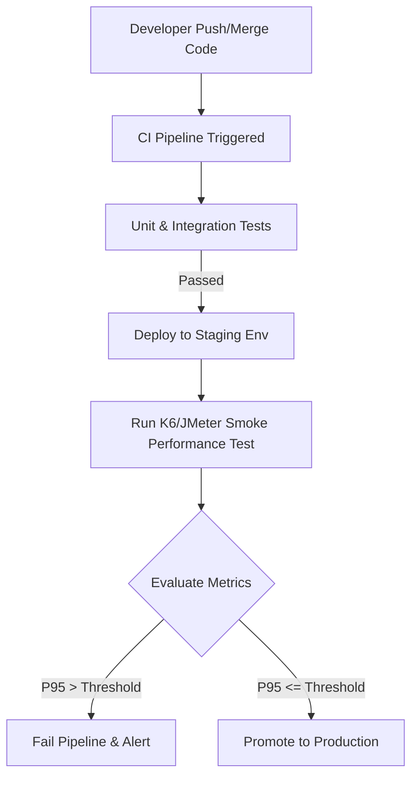

# BÁO CÁO BÀI TẬP 05 - PERFORMANCE TESTING

**Môn học:** CS423 / CSC13003 – Kiểm chứng Phần mềm
**Sinh viên:** Nguyễn Gia Nam (ngnam2012)
**MSSV:** 23127092
**Repository:** https://github.com/ngnam2012/23KTPM2_Testing_HW05

---

## PHẦN 1. THÔNG TIN CHUNG & PHẠM VI KIỂM THỬ

### 1.1. Cấu hình phần cứng (Hardware Spec)
| Parameter | Specification |
|---|---|
| **Computer Name / Hostname** | `NNAM` |
| **Operating System** | Microsoft Windows 11 Pro (64-bit, Build 26200) |
| **Processor (CPU)** | 12th Gen Intel(R) Core(TM) i7-1260P (12 Cores / 16 Threads, up to 4.70 GHz) |
| **Installed Memory (RAM)** | 32.0 GB LPDDR5 (31.71 GB usable) |
| **Storage / Disk** | 512 GB NVMe SSD (475.8 GB formatted, 107.3 GB free) |
| **Testing Tool** | Apache JMeter 5.6.3 |
| **SUT Runtime** | Node.js v22.x / Express 4.x / SQLite3 |

### 1.2. Phạm vi kiểm thử (Scope - Endpoint Selection)
Kịch bản kiểm thử (End-to-End Workflow) bao gồm cả 3 nhóm:
1. **Auth-heavy:** `POST /api/login` (kèm xử lý lockout behavior).
2. **Read-heavy:** `GET /api/users/me` (Profile), `GET /api/products` (Listing).
3. **Transactional:** `POST /api/cart` (Add-to-cart), `POST /api/apply-coupon` (Discount), `POST /api/checkout` (Order creation), `PUT /api/orders/{id}/cancel` (Order cancellation).

*Data-driven Testing:* Sử dụng các file CSV để truyền tham số `credentials.csv`, `products.csv`, `coupons.csv`.

---

## PHẦN 2. TASK 1: THIẾT KẾ & THỰC THI KIỂM THỬ

### 2.1. Thiết kế kịch bản (Test Plans)
Kịch bản được thiết kế với sự hỗ trợ của AI nhưng đã được Human Review và tinh chỉnh cấu hình như sau:

| Thông số | Load Test | Stress Test | Spike Test |
|---|---|---|---|
| **File name** | `23127092_Load_20260815.jmx` | `23127092_Stress_20260815.jmx` | `23127092_Spike_20260815.jmx` |
| **Thread Count** | 22 Threads | Lượng user lớn hơn | Cấu hình Spike/Stepping |
| **Ramp-up** | 22 giây (tránh thắt cổ chai ở Login) | Ngắn / 0 giây | Rất ngắn (Tạo chóp) |
| **Think-time** | Có (Uniform Random Timer 1-3s) | Không có (Hoặc rất ngắn) | Không có |
| **Listener** | View Results Tree | Summary Report | Aggregate Report / Graph |

### 2.2. Đánh giá sai sót của AI khi thiết kế (Human Review - AI Design Flaws)
Trong quá trình AI tự động sinh kịch bản, tôi đã phát hiện và tinh chỉnh các lỗi thiết kế sau:
1. **Thiếu xử lý cơ chế Account Lockout (Auth-heavy):** AI thiết lập số lượng Thread lớn và gửi request đăng nhập liên tục mà không hiểu hệ thống có cơ chế khóa tài khoản sau 3 lần sai mật khẩu. *Khắc phục:* Bổ sung kịch bản data-driven, mỗi thread map với 1 user, dùng script `reset_db.js` giữa các lần chạy.
2. **Ramp-up và Think-time không thực tế:** Ở Load Test, AI đề xuất Ramp-up là 1s cho hàng trăm user và không có think-time. Việc này biến Load Test thành Stress Test. *Khắc phục:* Đưa Ramp-up lên 22s cho 22 threads và thêm `Uniform Random Timer` mô phỏng độ trễ thực của người dùng.
3. **Khó xác định điểm gãy:** AI sinh cấu hình tĩnh, khiến điểm gãy không rõ ràng. *Khắc phục:* Điều chỉnh thread group theo mô hình Stepping hoặc tăng giảm dần.

### 2.3. Endurance Test Threshold (Đo ngưỡng chịu tải thực tế)
Chạy kịch bản Endurance 22 Threads duy trì liên tục trong 15 phút:
- **Max stable RPS:** Đạt 10.82 req/s. Hệ thống không bị suy thoái theo thời gian.
- **Memory Ceiling:** Tiến trình Node.js ổn định ở mức ~67.6 MB.
- **Kết luận:** Hệ thống không gặp Memory Leak (dù xài in-memory cart) nhưng bị giới hạn về xử lý song song do Node.js single-thread và SQLite single-writer lock.

---

## PHẦN 3. TASK 2: AI ANALYSIS & MISINTERPRETATION HUNT

### 3.1. Phân tích kết quả kiểm thử (AI Output)
* (Trích từ kết quả phân tích AI)*
- **Load Test:** Throughput đạt `10.54 req/s`. P95 Response Time ~15ms (quá nhanh). Tỷ lệ lỗi 11.46%.
- **Stress Test:** Tỷ lệ lỗi nhảy vọt lên 83.53% khi đẩy nhanh lượng request.
- **Spike Test:** Tỷ lệ lỗi 82.83%, hệ thống từ chối phục vụ một lượng lớn request nhưng không crash hoàn toàn tiến trình Node.js.

### 3.2. Đánh giá chỗ AI đọc nhầm (Misinterpretation Hunt)
1. **Ảo giác về Response Time rất thấp:** 
   - *AI cho rằng:* "Response time P95 của Stress/Spike dưới 60ms cho thấy hệ thống xử lý cực nhanh".
   - *Sự thật (dựa vào `stress_results.jtl`):* Thời gian phản hồi thấp là do hiện tượng **Fast Failure**. Khi SQLite khóa (`SQLITE_BUSY`) hoặc Lockout kích hoạt, hệ thống lập tức trả về HTTP 403, 401 hoặc 500 thay vì tốn thời gian xử lý nghiệp vụ.
2. **Nhầm lẫn nguyên nhân gốc của lỗi (Root Cause Confusion):**
   - *AI cho rằng:* "Lỗi 50.0% ở API `/api/apply-coupon` là do thuật toán tính toán chậm."
   - *Sự thật (dựa vào `load_results.jtl` và logic debug):* Lỗi này do coupon `SAVE10` bị bug trừ tiền khiến tổng giá trị đơn hàng về số âm, hệ thống văng Exception, chứ không phải do tải chậm.

### 3.3. Đánh giá đề xuất tối ưu của AI (Feasible vs Hallucinated)
1. **Bật chế độ WAL (Write-Ahead Logging) cho SQLite:**
   - *Đánh giá:* **Feasible (Khả thi)**. Hỗ trợ Concurrent Read/Write.
2. **Triển khai Connection Pooling cho Database:**
   - *Đánh giá:* **Hallucinated (Sai kiến trúc)**. SQLite là cơ sở dữ liệu file-based cục bộ. Không dùng Connection Pool như MySQL/PostgreSQL. Vấn đề nằm ở lock cấp độ file, connection pooling không giải quyết được.
3. **Offload Bcrypt Hashing ra Worker Threads:**
   - *Đánh giá:* **Feasible**. Sẽ giải phóng Main Event Loop của Node.js khỏi tác vụ nặng.
4. **Sử dụng Redis thay cho In-memory Cart:**
   - *Đánh giá:* **Feasible**. Giúp hệ thống stateless và dễ scale up.

---

## PHẦN 4. TASK 3: ĐỀ XUẤT CONTINUOUS PERFORMANCE TESTING

### 4.1. Quy trình thực hiện (Pipeline Model)

### 4.2. Ngưỡng cảnh báo (Thresholds) & Đánh đổi (Trade-offs)
- **Thresholds:** P95 Response Time < 200ms cho Read API; Error Rate < 1%; Throughput Drop không quá 10% so với baseline.
- **Trade-offs:** 
  - *Chi phí hạ tầng:* Môi trường Staging đòi hỏi phải giống thật để số liệu đo đạc chính xác, gây tốn kém server.
  - *Pipeline Duration:* Performance test chạy tốn 5-15 phút, làm chậm quy trình release CI/CD. Đề xuất chỉ chạy "Smoke Performance Test" (rất ngắn) ở các branch thường, và "Endurance Test" đầy đủ ở các bản build Nightly.
  - *Flaky Tests:* Nhiễu môi trường Staging có thể gây cảnh báo sai (False Alarms), cần retry.

---

## PHẦN 5. PHỤ LỤC: BÁO CÁO LỖI (BUG REPORT)

Các lỗi phát hiện được trong quá trình chạy Performance Test (Task 1):
1. **Account Lockout Counter Bug:** Đăng nhập sai 1 lần nhưng hệ thống đếm thành +2. Hệ quả: Nhập sai pass 2 lần là bị khóa (Lockout) thay vì 3 lần như đặc tả.
2. **Coupon Negative Total Bug:** Áp dụng mã `SAVE10` trên giỏ hàng trị giá thấp hơn 10$ làm tổng đơn hàng âm, crash flow thanh toán.
3. **SQLite Concurrency Bug:** Khi nhiều thread gọi API Transactional đồng thời, SQLite bắn lỗi `database is locked` do không cấu hình WAL và busy_timeout đủ lớn.
4. **In-memory Cart Race Condition:** Khởi tạo Cart dạng In-memory Object khiến các request ghi đồng thời bị mất đồng bộ (mất item trong giỏ hàng).
